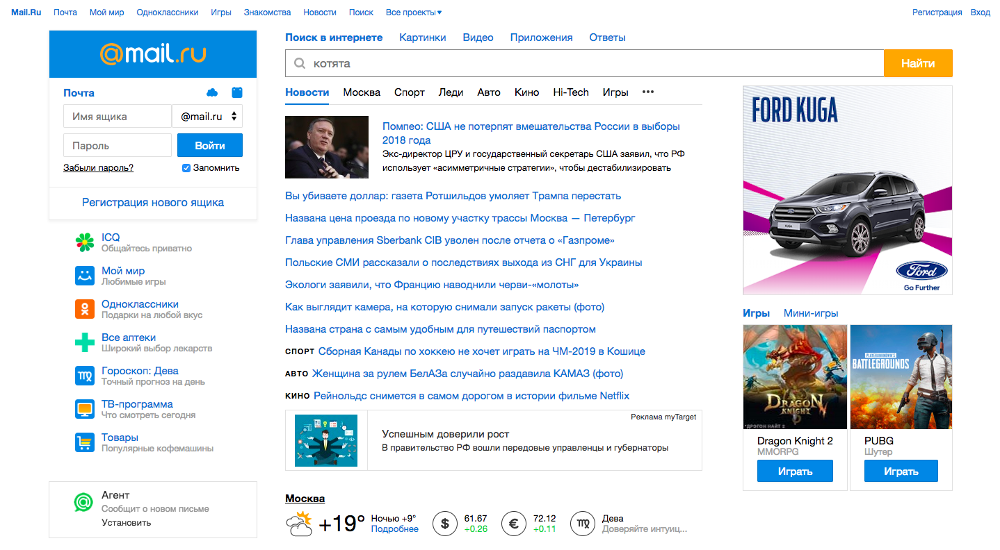

# Netcracker-Study-Course

Educational project during study at [Netcracker](https://www.netcracker.com/)  
**An attempt** to make a pixel-perfect copies of [Mail.Ru](https://www.mail.ru/) and [Yandex](https://www.yandex.ru)

## QuickStart
##### 1. Install [Node.js® and npm](https://nodejs.org/en/download/) if they are not already on your machine.
##### 2. Run `npm i` in console to install all dependences.
##### 3. Execute `npm run serve` in console to start gulp process.

## Preview

**Mail.ru**

**Yandex**  
